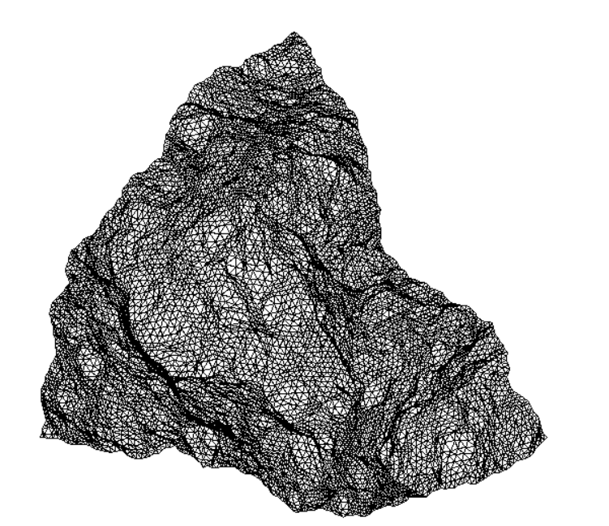
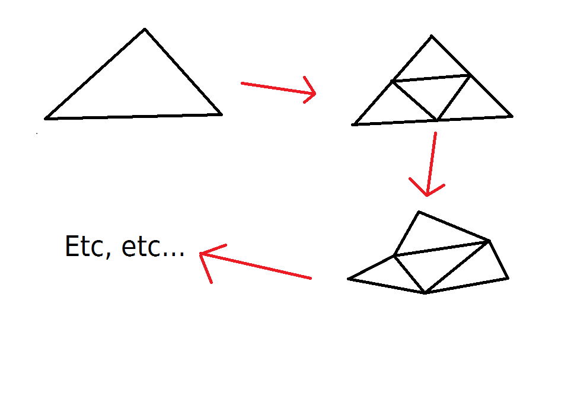
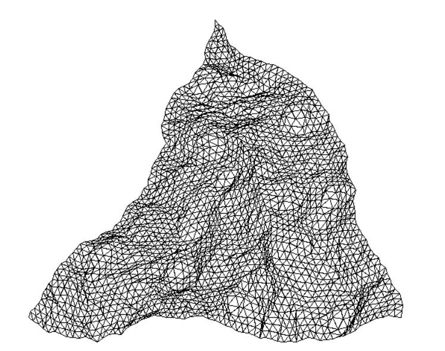
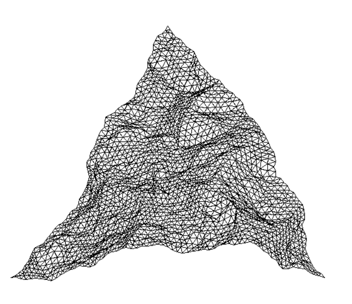
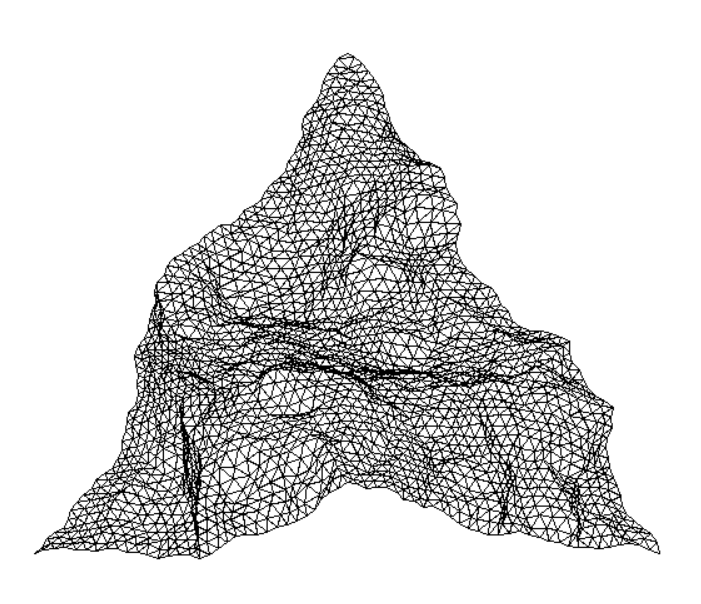

# 2D Fractal Landscape Generator

This program aims to represent a 2D Fractal Landscape made in Python, mesmerizing mountain landscapes, or at list a fraction of it. Developed using Pygame library, this program is inspired in this [website](https://grahamsprojects.blogspot.com/2014/08/creating-2d-fractal-landscape-generator.html). I didn't find the source code, so I ended up making my own. I hope you like it.
.
<p align="center">
  
</p>

## About The Project

Fractals have always captivated me with their infinite complexity and stunning visuals. Inspired by this fascination, I decided to develop this program. Starting with a simple triangle, the program recursively subdivides it into smaller triangles, introducing randomized perturbations to the vertices to simulate natural mountainous terrains, as shown in the picture below:

<p align="center">
  
</p>

### Built With

This project is implemented using Python and Pygame, making it accessible and easy to run on any system that supports these technologies.

- 
- 

## Getting Started

To get a local copy up and running follow these simple steps.

### Prerequisites

This project requires Python and Pygame. You can install Python from [python.org](https://python.org) and Pygame via pip:

```sh
pip install pygame
```
## Installation

git clone https://github.com/Mixnikon108/2D-Terrain-Generation.git

Navigate to the project directory:

```sh
cd 2D-Terrain-Generation
```

## Usage

To run the program, execute the following command in the project directory:

```sh
python terrain.py
```

This will open a window displaying the fractal landscape. Each run generates a new, unique terrain. If you want more chaos, change the parameter `roughtness` inside `random_perpendicular_point` function, located at `utils.py`. You can change the resolution too by changing the `depth` variable. The higher the number, the more resolution you get.

## Gallery
Here are some examples of fractal landscapes generated by this tool:

<p align="center">
  <table>
    <tr>
      <td style="text-align: center;"></td>
      <td style="text-align: center;"></td>
    </tr>
    <tr>
      <td style="text-align: center;"></td>
      <td style="text-align: center;"></td>
    </tr>
  </table>
</p>


## Contact
Jorge de la Rosa - [@mixnikon](https://twitter.com/mixnikon)
Project Link: [https://github.com/Mixnikon108/2D-Terrain-Generation.git](https://github.com/Mixnikon108/2D-Terrain-Generation.git)

